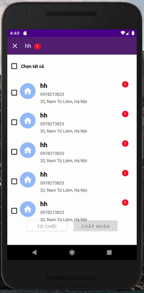

# React Native Flatlist Multiple Choose
[ ](https://www.npmjs.com/package/react-native-flatlist-multiple-choose)

 

## Content

- [Installation](#installation)
- [Getting started](#getting-started)
- [API](#api)
- [Contribution](#contribution)

## Installation
- This component use "React Hook" under the hood so if you want to use this, your project must use React-Native > 0.59 (supported hook)
* 1.`npm i react-native-flatlist-multiple-choose --save`
* 2.`import {FlatlistMultipleChoose} from 'react-native-flatlist-multiple-choose';`

## Getting started  

Add `react-native-flatlist-multiple-choose` to your js file.   

`import {FlatlistMultipleChoose} from 'react-native-flatlist-multiple-choose` 

### Basic usage

```javascript
<FlatlistMultipleChoose itemStyle={{margin : 10,borderColor : '#f3f3f3',borderBottomWidth : 0.8}}  
    extraData={context.state} 
    data={context.state.missionAddress[this.state.missionsList.key].missions}
    onChangeDatasChoosed={(data) => this.setState({ selectedMission: data })} 
    customItem={<MissionHolder navigationKey={this.props.navigation.state.key} />} />
```

- customItem is where you can custome your item of you "Flatlist Multiple Choose"

- onChangeDatasChoosed is a callback function when "Flatlist Multiple Choose" return an array include all of your selected item every time after user choose an item

### Api

Props              | Type     | Optional | Default     | Description
----------------- | -------- | -------- | ----------- | -----------
listStyle  | ViewPropTypes.style  | true |   |   Custom style of Flatlist
itemStyle  | ViewPropTypes.style  | true |   |   Custom style of Item
data | PropTypes.array |false |   | Data of flatlist
customItem  |  PropTypes.element | false |  | Custom item of flatlist
onChangeDatasChoosed | PropTypes.func.isRequired |true |   | A callback return array of Items selected
checkedCheckBoxColor | PropTypes.string | true | 'red'  | Custom color of checkbox when it's checked
checkedBackgroundColor | PropTypes.string | true | '#F3F9FF'  | Custom background color of item when it's checked
unCheckedBackgroundColor | PropTypes.string | true | '#ffff'  | Custom background color of item when it's unchecked
selectAllText | PropTypes.string | true | 'Select All'  | Custom select all title

## Contribution

Issues are welcome. Please add a screenshot of bug and code snippet. Quickest way to solve issue is to reproduce it on one of the examples.

Pull requests are welcome. If you want to change API or making something big better to create issue and discuss it first.